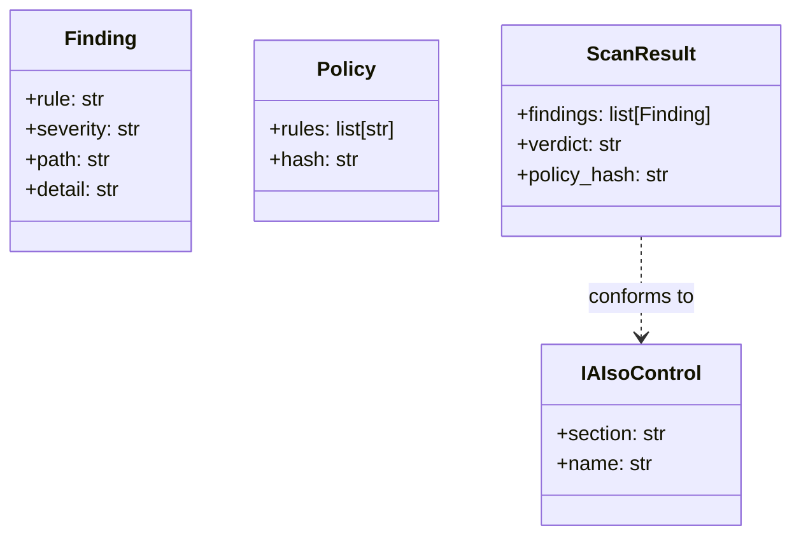
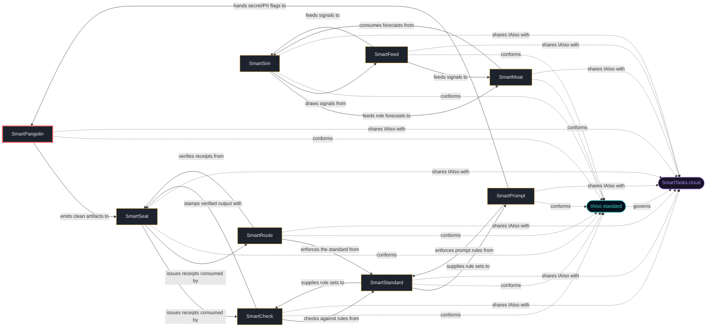

<!-- mcp-name: io.github.smarttasksorg/smartpangolin · part of the Smart* family -->
<h1 align="center">🦔 SmartPangolin</h1>
<p align="center"><b>Scan before you share. Stop leaking secrets into AI models, agents, and tools.</b></p>
<p align="center">
  <a href="https://iaiso.org">IAIso §1 · Secure Sharing</a> ·
  <a href="https://smarttasks.cloud">SmartTasks.cloud</a> ·
  <a href="#part-of-the-smart-family">the Smart* family</a>
</p>

---

## You paste your repo into an AI. What did you just leak?

As AI reshapes how we work, a new gap opens: feeding code/docs to ai leaks secrets, keys, and internal detail. **SmartPangolin** closes it —
`scan` at the exact moment the gap bites, and it works the second you clone it
(a synthetic demo ships in `demo/`).

```bash
pip install smartpangolin
smartpangolin --demo        # run against the bundled demo
```

## Run it in your stack

| Where you work | How you run it |
|---|---|
| **Python** | `pip install smartpangolin` |
| **Go · Java · Node · PHP** | native ports in [`ports/`](ports/), each verified against the Python reference by [`ports/conformance/run.sh`](ports/conformance/run.sh) |
| **LangChain · LlamaIndex · function-calling · MCP** | drop-in integration kits in [`kits/`](kits/) |
| **AI coding tools** (Cursor, Claude, Cline, Windsurf, Zed) | MCP server: `smartpangolin-mcp` |
| **CI / pre-commit** | add the hook from [`.pre-commit-hooks.yaml`](.pre-commit-hooks.yaml) |

## What's in this repo

- **Core engine** — [`src/smartpangolin/`](src/smartpangolin/): scan() -> ScanResult. Deterministic, dependency-free.
- **CLI** — `pango pack | verify | triage | tree | purge | policy | init`, the full fail-closed packager. `smartpangolin --demo` runs the quick demo; the family `scan()` API is the lightweight scanner.
- **Language ports** — [`ports/`](ports/): native Go, Java, Node, PHP implementations that reproduce the Python reference, with a shared conformance harness.
- **Integration kits** — [`kits/`](kits/): LangChain, LlamaIndex, function-calling, MCP, CI, and pre-commit starters.
- **Adapters** — [`adapters/`](adapters/): GitHub Action and language adapters.
- **Editor integration** — [`integrations/`](integrations/): VS Code integration.
- **MCP server** — `smartpangolin-mcp`, for agentic/AI-coding clients.
- **Reference docs** — [`docs/`](docs/): 10 documents (CLI, policy, design, FAQ, porting…).
- **Also included** — a runnable [`demo/`](demo/), [`examples/`](examples/), the IAIso mapping [`spec/iaiso-map.json`](spec/iaiso-map.json), a browser [`site/playground.html`](site/playground.html), plus public smoke tests in `tests/`.

## How it works

Rule IDs are namespaced `SEC-*` so output looks kin to the rest of the family
(SmartCheck's `CHECK-*`, SmartSeal's `SEAL-*`, etc.). Deterministic, dependency-free, fail-loud.

### The data objects (UML)

These are real dataclasses in [`src/smartpangolin/models.py`](src/smartpangolin/models.py) — the
diagram and the code are the same thing:



## Where it sits in the architecture

SmartPangolin doesn't stand alone — it stacks with the family, and everything conforms to
the IAIso standard — the same standard that governs SmartTasks' own apps, while each tool here stays standalone and drops into your architecture:



- **SmartPangolin emits clean artifacts to SmartSeal** →

Open [`site/playground.html`](site/playground.html) for the interactive version.

## Part of the Smart* family

One system, not nine projects — same mascot, same manifesto voice, same rule-ID style,
all aligned to the [IAIso standard](https://github.com/SmartTasksOrg/IAIso). Each is an independent, open-source, single-purpose tool you can integrate into your own architecture:

| Tool | IAIso | What it does |
|---|---|---|
| [SmartPrompt](https://github.com/SmartTasksOrg/smartprompt) | §4 · Context | Lint before you send. Bad prompt in, bad work out — and it's your name on it. |
| [SmartCheck](https://github.com/SmartTasksOrg/smartcheck) | §2 · Verification | Check before you sign off. Catch the AI when it's confidently wrong. |
| [SmartSeal](https://github.com/SmartTasksOrg/smartseal) | §3 · Provenance | Seal what you ship. A signed receipt so anyone can verify what they received. |
| [SmartStandard](https://github.com/SmartTasksOrg/smartstandard) | §7 · Standards | Standardize before you scale. One shared, auditable convention for AI-assisted work. |
| [SmartSim](https://github.com/SmartTasksOrg/smartsim) | §8 · Foresight | Simulate before it hits you. See your role's task-by-task collapse sequence. |
| [SmartMoat](https://github.com/SmartTasksOrg/smartmoat) | §6 · Workforce | Know your moat. Score the tasks AI can't easily take — and widen them. |
| [SmartRoute](https://github.com/SmartTasksOrg/smartroute) | §5 · Orchestration | Route only what you trust. Gate agents and tools with trust scores and guardrails. |
| [SmartFeed](https://github.com/SmartTasksOrg/smartfeed) | §9 · Awareness | Distill the firehose. A tight brief of only what moves your work. |

**Backed by the standard:** SmartPangolin implements **IAIso §1 · Secure Sharing**.
**Open-source edition:** this repo is the simplified, single-purpose version, built for any org to integrate into its own architecture. SmartTasks' desktop app and [SmartTasks.cloud](https://smarttasks.cloud) run a more advanced, deeply-integrated implementation of the same IAIso governance — a separate product, not this code bundled.

## Who's behind this

- **Roen Branham** — CEO & AI Strategy Architect · CISSP-certified AI, security & governance architect; author of IAIso and sole inventor of the Z4 Semantic Fabric patent application. [LinkedIn](https://www.linkedin.com/in/roen-branham-167ab29/)
- **Le Vu Tanh** — CTO & Core Engineering Lead · Chief architect of the Cortex engine; large-scale system reliability and low-latency infrastructure — the engineer who ships what gets architected. [LinkedIn](https://www.linkedin.com/in/lee-thanh-76aa8ba0/)

The team behind IAIso & SmartTasks: a CISSP-certified security & governance architect
and a large-scale systems engineer — 20+ years shipping secure, AI-driven platforms for
regulated, blue-chip environments (Allianz, BMW, Rolls-Royce, Heidenhain).

<!-- SMARTTASKS-MODELS:START -->
## Runs on governed local models

Every build ships **SHA256SUMS** and a supply-chain + red-team scan — the same provenance discipline SmartPangolin enforces on your repos.

This tool is local-first, so pair it with models you can actually vet. **SmartTasks** publishes 21+ governance-validated GGUF builds on Hugging Face — each with a machine-readable **scorecard** (capability tiers L1 Layman → L5 Agentic, IAIso conformance invariants (pass/warn/fail), OWASP-mapped garak red-team, transparency probes (viewpoint-alignment / over-refusal), and per-file SHA-256). Gate model selection on evidence, not vibes — and every finding, including warnings, is published in full.

→ **[SmartTasks on Hugging Face](https://huggingface.co/smarttasks)** · [Qwen3.6-27B](https://huggingface.co/smarttasks/Qwen3.6-27B-GGUF) (L5 agentic) · [react-agent-coder-llama-3.1-8b](https://huggingface.co/smarttasks/react-agent-coder-llama-3.1-8b-GGUF) (agentic coder) · [gpt-oss-20b](https://huggingface.co/smarttasks/gpt-oss-20b-GGUF) (open reasoning)
<!-- SMARTTASKS-MODELS:END -->

## Get in touch

- **Companies & enterprises:** [enterprise@smarttasks.cloud](mailto:enterprise@smarttasks.cloud) — we help
  teams integrate SmartPangolin + IAIso into their architecture so governance and
  audit-readiness become a byproduct of how they already work.
- **The standard:** [IAIso](https://github.com/SmartTasksOrg/IAIso) · [iaiso.org](https://iaiso.org)
- **The product:** [SmartTasks.cloud](https://smarttasks.cloud)

Built by **SmartTasks Lab**. Apache-2.0. Contributions welcome.

<!-- SMARTBENCH-METRICS:START -->
## Measured effectiveness (benchmarked)

SmartTasks tests this tool against live local models, not just unit fixtures. Headline recall across difficulty levels: **100%**.

**How to read this.** These come from the Smart\* *effectiveness benchmark*: a local model is driven to produce content of increasing difficulty; the tool (detects secrets (API keys, private keys, dangerous files), including base64/hex-encoded ones) is then run and its verdict scored against an independent oracle (broader than the tool's own rules, so a miss is a real gap).

- **Recall** — of cases that genuinely contained the target, the share the tool caught. Low recall = coverage gap.
- **Precision** — of what the tool flagged, the share that were real problems. Below 100% = false positives.
- **Levels** — 0 canary · 1 basic · 2 realistic · 3 obfuscated · 4 adversarial (hardest).
- **Invalid** — the model failed to produce the scenario (e.g. emitted a placeholder, not a real secret); not scored, so the tool is neither credited nor penalized.
- **Sample size** — model output varies run-to-run; small *n* is noisy. Pooled numbers combine recent runs.

| level | n | accuracy | precision | recall |
|---|---|---|---|---|
| 0 · canary | 2 | 100% | 100% | 100% |
| 1 · basic | 8 | 100% | 100% | 100% |
| 2 · realistic | 8 | 100% | 100% | 100% |
| 3 · obfuscated | 7 | 100% | 100% | 100% |
| 4 · adversarial | 8 | 100% | 100% | 100% |

**What this run shows:**
- Instrument check (canary) passes — the fixed sanity cases are all correct, so the higher-level numbers are trustworthy.
- **Strong** at: basic, realistic, obfuscated, adversarial — near-complete recall.
- No false positives observed (precision 100%) — the tool does not flag clean input.

_Source: run `20260804T134233-fad704` · 2026-08-04T13:45:23 · model(s): llama-3.1-8b-lexi-uncensored-v2 · repeats 8. Numbers reflect these model(s); output varies run-to-run, so re-run and regenerate to refresh._
<!-- SMARTBENCH-METRICS:END -->
